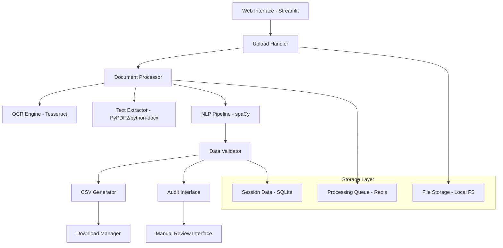

# Design Document

## Overview

The Document Processing Pipeline is a web-based automation system that converts semi-structured and unstructured PDF/DOCX files containing HMO licensing data into standardized CSV format. The system uses a hybrid approach combining OCR, NLP, and machine learning techniques to intelligently extract and structure data from various document layouts.

## Architecture

### High-Level Architecture



### Technology Stack

- **Frontend**: Streamlit (Python web framework)
- **Backend**: FastAPI for API endpoints
- **Document Processing**: 
  - PyPDF2 for PDF text extraction
  - python-docx for DOCX processing
  - Tesseract OCR for image-based content
- **NLP/ML**: 
  - spaCy for named entity recognition
  - pandas for data manipulation
  - scikit-learn for confidence scoring
- **Database**: SQLite for session and audit data
- **Queue**: Redis for processing queue management
- **Deployment**: Docker containers on Ubuntu server

## Components and Interfaces

### 1. Web Interface Component

**Purpose**: Provides user-friendly interface for file upload and result download

**Key Classes**:
- `StreamlitApp`: Main application interface
- `FileUploader`: Handles drag-and-drop file uploads
- `ProgressTracker`: Shows processing status
- `ResultsDownloader`: Manages CSV file downloads

**Interfaces**:
```python
class FileUploadInterface:
    def upload_file(self, file: UploadedFile) -> str
    def validate_file(self, file: UploadedFile) -> bool
    def get_upload_status(self, upload_id: str) -> dict

class ConfigurationInterface:
    def set_column_mappings(self, mappings: dict) -> None
    def get_default_columns(self) -> list
    def validate_column_config(self, config: dict) -> bool
```

### 2. Document Processing Engine

**Purpose**: Core processing logic for document analysis and data extraction

**Key Classes**:
- `DocumentProcessor`: Main orchestrator
- `PDFProcessor`: Handles PDF-specific processing
- `DOCXProcessor`: Handles DOCX-specific processing
- `OCRProcessor`: Manages Tesseract OCR operations
- `TableDetector`: Identifies and extracts tabular data

**Interfaces**:
```python
class DocumentProcessorInterface:
    def process_document(self, file_path: str) -> ProcessingResult
    def extract_text(self, file_path: str) -> str
    def detect_tables(self, content: str) -> list[Table]
    def extract_entities(self, text: str) -> dict

class ProcessingResult:
    extracted_data: dict
    confidence_scores: dict
    flagged_fields: list
    processing_metadata: dict
```

### 3. NLP Pipeline Component

**Purpose**: Intelligent text analysis and entity extraction

**Key Classes**:
- `EntityExtractor`: Uses spaCy for named entity recognition
- `AddressParser`: Specialized address parsing and standardization
- `DateNormalizer`: Converts various date formats to standard format
- `ConfidenceCalculator`: Assigns confidence scores to extracted data

**Interfaces**:
```python
class NLPPipelineInterface:
    def extract_entities(self, text: str) -> dict
    def parse_addresses(self, text: str) -> list[Address]
    def normalize_dates(self, date_strings: list) -> list[str]
    def calculate_confidence(self, extraction: dict) -> dict

class Address:
    street: str
    city: str
    postal_code: str
    confidence: float
```

### 4. Data Validation and Quality Assurance

**Purpose**: Validates extracted data and manages quality control

**Key Classes**:
- `DataValidator`: Validates extracted data against expected formats
- `QualityAssessment`: Generates quality reports and confidence metrics
- `AuditManager`: Manages flagged records and manual review workflow

**Interfaces**:
```python
class ValidationInterface:
    def validate_record(self, record: dict) -> ValidationResult
    def flag_low_confidence(self, records: list, threshold: float) -> list
    def generate_quality_report(self, results: list) -> QualityReport

class ValidationResult:
    is_valid: bool
    confidence_score: float
    validation_errors: list
    suggested_corrections: dict
```

### 5. Audit and Manual Review System

**Purpose**: Provides interface for manual review of flagged records

**Key Classes**:
- `AuditInterface`: Web interface for manual review
- `RecordEditor`: Allows editing of extracted field values
- `AuditTracker`: Tracks review status and changes

**Interfaces**:
```python
class AuditSystemInterface:
    def get_flagged_records(self, session_id: str) -> list[dict]
    def update_record(self, record_id: str, updates: dict) -> bool
    def mark_reviewed(self, record_id: str, reviewer: str) -> None
    def export_audited_data(self, session_id: str) -> str
```

## Data Models

### Core Data Structures

```python
@dataclass
class HMORecord:
    council: str = ""
    reference: str = ""
    hmo_address: str = ""
    licence_start: str = ""
    licence_expiry: str = ""
    max_occupancy: int = 0
    hmo_manager_name: str = ""
    hmo_manager_address: str = ""
    licence_holder_name: str = ""
    licence_holder_address: str = ""
    number_of_households: int = 0
    number_of_shared_kitchens: int = 0
    number_of_shared_bathrooms: int = 0
    number_of_shared_toilets: int = 0
    number_of_storeys: int = 0
    confidence_scores: dict = field(default_factory=dict)
    
@dataclass
class ProcessingSession:
    session_id: str
    upload_timestamp: datetime
    file_name: str
    file_size: int
    processing_status: str
    extracted_records: list[HMORecord]
    flagged_records: list[str]
    quality_metrics: dict

@dataclass
class ColumnMapping:
    user_column_name: str
    system_field_name: str
    data_type: str
    validation_rules: list
```

### Database Schema

```sql
-- SQLite schema for session management
CREATE TABLE processing_sessions (
    session_id TEXT PRIMARY KEY,
    file_name TEXT NOT NULL,
    file_size INTEGER,
    upload_timestamp DATETIME,
    processing_status TEXT,
    quality_score REAL,
    total_records INTEGER,
    flagged_records INTEGER
);

CREATE TABLE extracted_records (
    record_id TEXT PRIMARY KEY,
    session_id TEXT,
    record_data JSON,
    confidence_scores JSON,
    is_flagged BOOLEAN,
    review_status TEXT,
    reviewer_notes TEXT,
    FOREIGN KEY (session_id) REFERENCES processing_sessions(session_id)
);

CREATE TABLE column_mappings (
    mapping_id TEXT PRIMARY KEY,
    session_id TEXT,
    user_column_name TEXT,
    system_field_name TEXT,
    FOREIGN KEY (session_id) REFERENCES processing_sessions(session_id)
);
```

## Error Handling

### Error Categories and Responses

1. **File Upload Errors**
   - Unsupported file format → Clear error message with supported formats
   - File size exceeded → Error with size limit information
   - Corrupted file → Error with suggestion to re-upload

2. **Processing Errors**
   - OCR failure → Fallback to text extraction, warn about potential quality issues
   - Memory issues → Process in chunks, show progress indicator
   - Timeout → Retry mechanism with exponential backoff

3. **Data Extraction Errors**
   - No data found → Provide sample document format guidance
   - Low confidence extraction → Flag for manual review
   - Format inconsistencies → Attempt standardization, report success rate

4. **System Errors**
   - Database connection issues → Graceful degradation with local storage
   - Queue system failure → Direct processing with progress indication
   - Disk space issues → Clean up temporary files, alert administrator

### Error Recovery Strategies

```python
class ErrorHandler:
    def handle_processing_error(self, error: Exception, context: dict) -> ProcessingResult:
        if isinstance(error, OCRError):
            return self.fallback_to_text_extraction(context)
        elif isinstance(error, MemoryError):
            return self.process_in_chunks(context)
        elif isinstance(error, TimeoutError):
            return self.retry_with_backoff(context)
        else:
            return self.log_and_fail_gracefully(error, context)
```

## Testing Strategy

### Unit Testing
- **Document Processors**: Test PDF/DOCX parsing with sample files
- **NLP Components**: Test entity extraction with known text samples
- **Data Validators**: Test validation logic with edge cases
- **API Endpoints**: Test all REST endpoints with various inputs

### Integration Testing
- **End-to-End Workflow**: Upload → Process → Download complete flow
- **Error Scenarios**: Test error handling and recovery mechanisms
- **Performance Testing**: Test with large files and concurrent users
- **Quality Assurance**: Test extraction accuracy with known datasets

### Test Data Strategy
```python
# Sample test cases
TEST_CASES = {
    "simple_pdf": {
        "file": "sample_hmo_simple.pdf",
        "expected_records": 5,
        "expected_fields": ["council", "reference", "hmo_address"],
        "min_confidence": 0.8
    },
    "complex_table": {
        "file": "sample_hmo_table.pdf", 
        "expected_records": 50,
        "expected_fields": ALL_FIELDS,
        "min_confidence": 0.7
    },
    "scanned_document": {
        "file": "sample_hmo_scanned.pdf",
        "expected_records": 10,
        "ocr_required": True,
        "min_confidence": 0.6
    }
}
```

### Deployment Testing
- **Ubuntu Compatibility**: Test installation and startup on Ubuntu 20.04/22.04
- **Git Deployment**: Test clone, setup, and startup scripts
- **Resource Usage**: Monitor CPU, memory, and disk usage under load
- **Security**: Test file upload security and data handling

### Performance Benchmarks
- File processing: < 30 seconds for files up to 10MB
- Concurrent users: Support 10 simultaneous uploads
- Memory usage: < 2GB RAM for typical operations
- Accuracy targets: > 85% field extraction accuracy for structured documents